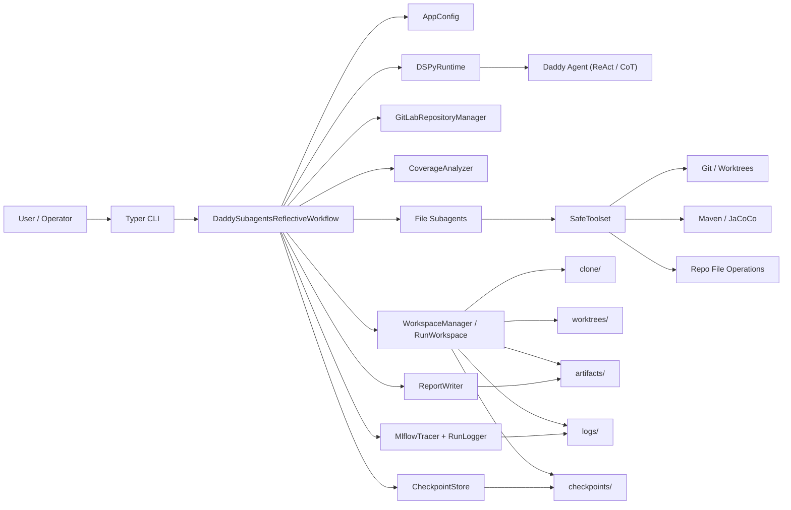
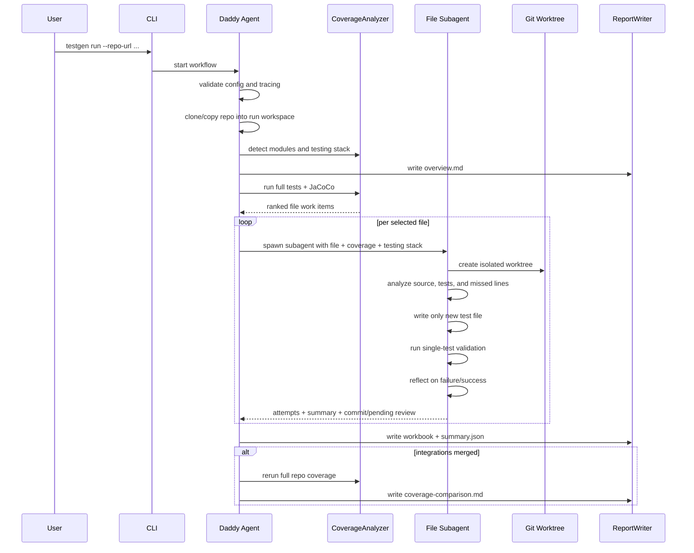
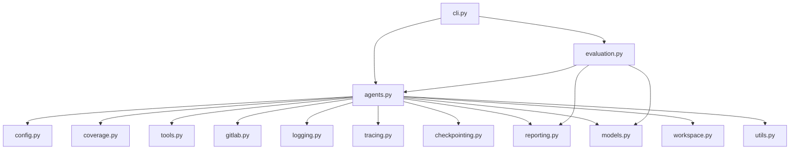
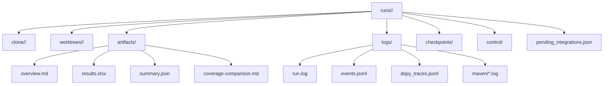

# HLAM and Architecture

This document captures the high-level architecture map for the DSPy-based test generation platform and shows how the main runtime components fit together.

## HLAM

HLAM here means High-Level Architecture Map:

- `User / Operator`
  - starts runs, pauses/resumes work, reviews integrations, and triggers evaluation
- `CLI Layer`
  - entrypoint for `run`, `status`, `logs`, `pause`, `resume`, `review`, `integrate`, and `eval`
- `DaddySubagentsReflectiveWorkflow`
  - central orchestrator for repo analysis, coverage collection, work-item ranking, subagent dispatch, checkpointing, and post-merge coverage refresh
- `Subagents`
  - one subagent per target source file, each isolated in its own Git worktree
- `Safe Tool Layer`
  - bounded file, Git, and Maven test operations exposed to DSPy
- `Run Workspace`
  - isolated run directories for clone, worktrees, artifacts, logs, and checkpoints
- `Observability Layer`
  - structured logs, human-readable logs, DSPy traces, and MLflow tracking
- `Reporting Layer`
  - overview, workbook, JSON summary, and coverage comparison outputs
- `Evaluation Layer`
  - model-only benchmark execution over synthetic Maven fixtures

## System Architecture

## Workflow Architecture

## Module View

## Parent and Child Agent Responsibilities

- `Daddy agent`
  - understands repo structure
  - detects test framework and version
  - runs global coverage
  - ranks candidate files
  - spawns subagents
  - persists checkpoints and reports
  - reruns global coverage after merged changes
- `Child subagent`
  - owns exactly one file
  - receives repo-level testing-stack context
  - works inside one worktree
  - creates only new test files
  - validates through Maven single-test execution
  - returns attempts, reflections, and a final summary

## Data and Artifact Layout

## Key Runtime Decisions

- Only one production workflow exists right now: `daddy_subagents_reflective`
- Test generation is limited to Maven/JaCoCo Java repos in v1
- The detected testing framework and version are passed from repo analysis into child-agent prompts
- Subagents may create only new files under `src/test/java`
- Review-first integration is the default
- Post-merge full-repo coverage refresh is supported
- Evaluation varies the model only, not the workflow

## Future Evolution

- Add shared memory so later subagents can reuse prior successes and avoid prior failures
- Add project-level memory across runs
- Extend project adapters for UI stacks
- Add prompt-optimization loops from successful DSPy traces
